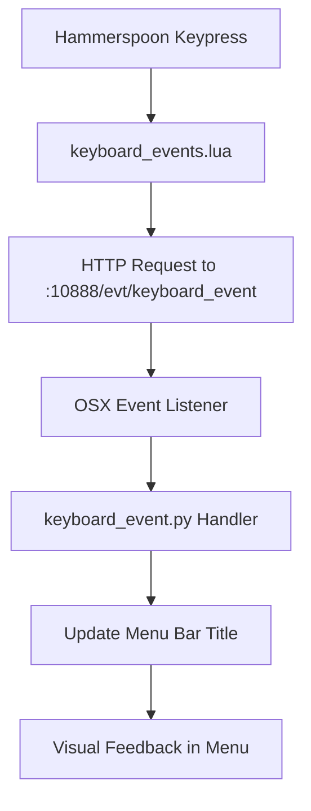

# Keyboard Event System Documentation

## Overview

The keyboard event system provides real-time visual feedback of keyboard activity in the macOS menu bar through integration between Hammerspoon and the OSX automation system. When active, it shows the current keypress with unicode modifier symbols directly in the menu bar.

## Visual Behavior

### Menu Bar States

| State | Menu Display | Description |
|-------|-------------|-------------|
| **Inactive** | `""` | No keyboard logging |
| **Logger Started** | `🎹` | Logger active, waiting for keypresses |
| **Keypress** | `🎹{mods}{key}` | Shows current key with modifiers |
| **Logger Stopped** | `""` | All keyboard indicators removed |

### Example Menu Transitions

```
Initial state:        ""
Start logger:         "🎹"
Press 'a':           "🎹a"
Press Cmd+R:         "🎹⌘r"
Press Shift+Up:      "🎹⇧↑"
Press Cmd+Alt+D:     "🎹⌘⌥d"
Stop logger:         ""
```

## Unicode Symbols

### Modifier Keys
- **⌘** Command (`cmd`)
- **⌃** Control (`ctrl`)
- **⌥** Option/Alt (`alt`)
- **⇧** Shift (`shift`)
- **🌐** Function (`fn`)

### Special Keys
- **␣** Space
- **↩** Return/Enter
- **⇥** Tab
- **⎋** Escape
- **⌫** Delete/Backspace
- **↑** Up Arrow
- **↓** Down Arrow
- **←** Left Arrow
- **→** Right Arrow
- **?** Unknown key

## Hammerspoon Requirements

### File Structure

The keyboard event system requires a modular Hammerspoon configuration:

```
~/.hammerspoon/
├── init.lua              # Main configuration
└── keyboard_events.lua   # Keyboard event module (required)
```

### Required Hammerspoon Module

Create `~/.hammerspoon/keyboard_events.lua`:

```lua
-- keyboard_events.lua - Keyboard event logging and HTTP integration module

local M = {}

-- Function to send HTTP event to OSX automation system
local function sendHTTPEvent(event_type, params)
	local port = os.getenv("OSX_EVTS_PORT") or "10888"
	local url = string.format("http://127.0.0.1:%s/evt/%s", port, event_type)
	local paramStr = ""
	for key, value in pairs(params) do
		if paramStr ~= "" then paramStr = paramStr .. "&" end
		paramStr = paramStr .. key .. "=" .. hs.http.encodeForQuery(tostring(value))
	end
	if paramStr ~= "" then url = url .. "?" .. paramStr end
	
	hs.http.get(url, nil, function(status, body, headers)
		-- Optional: handle response
		if status ~= 200 then
			print("Failed to send keyboard event: " .. tostring(status))
		end
	end)
end

-- Key event logger
local keyLogger = hs.eventtap.new({ hs.eventtap.event.types.keyDown }, function(evt)
	local keyCode = evt:getKeyCode()
	local flags = evt:getFlags()
	local char = hs.keycodes.map[keyCode]
	
	-- Print to console (optional)
	print(string.format("%s key - keyCode: %d, modifiers: %s", char or "nil", keyCode, hs.inspect(flags)))
	
	-- Convert flags table to comma-separated string
	local modifiersList = {}
	for modifier, enabled in pairs(flags) do
		if enabled then
			table.insert(modifiersList, modifier)
		end
	end
	local modifiersString = table.concat(modifiersList, ",")
	
	-- Send to OSX automation system
	sendHTTPEvent("keyboard_event", {
		key_code = keyCode,
		key_char = char or "unknown",
		modifiers = modifiersString
	})
	
	return false
end)

-- Setup function to initialize keyboard event logging
function M.setup(bindFunction, notifyFunction)
	-- Store references to the main config functions
	local Bind = bindFunction
	local Notify = notifyFunction
	
	-- Toggle key logger with Cmd+Ctrl+K
	Bind({ "cmd", "ctrl" }, "k", function()
		if keyLogger:isEnabled() then
			keyLogger:stop()
			-- Send event that logging stopped
			sendHTTPEvent("keyboard_event", {
				key_code = 0,
				key_char = "logger_stopped",
				modifiers = "system"
			})
			Notify("Key logger stopped")
		else
			keyLogger:start()
			-- Send event that logging started
			sendHTTPEvent("keyboard_event", {
				key_code = 0,
				key_char = "logger_started", 
				modifiers = "system"
			})
			Notify("Key logger started - sending events to OSX automation")
		end
	end)
end

-- Function to check if logger is currently enabled
function M.isEnabled()
	return keyLogger:isEnabled()
end

-- Function to manually start/stop logger
function M.start()
	keyLogger:start()
end

function M.stop()
	keyLogger:stop()
end

-- Function to send custom keyboard events
function M.sendEvent(key_code, key_char, modifiers)
	sendHTTPEvent("keyboard_event", {
		key_code = key_code or 0,
		key_char = key_char or "custom",
		modifiers = modifiers or ""
	})
end

return M
```

### Integration in init.lua

Add to your `~/.hammerspoon/init.lua`:

```lua
-- Your existing Hammerspoon configuration...

-- Import keyboard events module
local KeyboardEvents = require('keyboard_events')

-- Setup keyboard event logging (pass your Bind and Notify functions)
KeyboardEvents.setup(hs.hotkey.bind, hs.alert.show)
```

### Environment Variable Setup

The system uses the `OSX_EVTS_PORT` environment variable. Set this up via LaunchAgent:

1. Create `~/Library/LaunchAgents/com.user.environment.plist`:

```xml
<?xml version="1.0" encoding="UTF-8"?>
<!DOCTYPE plist PUBLIC "-//Apple//DTD PLIST 1.0//EN" "http://www.apple.com/DTDs/PropertyList-1.0.dtd">
<plist version="1.0">
<dict>
    <key>Label</key>
    <string>com.user.environment</string>
    <key>ProgramArguments</key>
    <array>
        <string>sh</string>
        <string>-c</string>
        <string>launchctl setenv OSX_EVTS_PORT 10888</string>
    </array>
    <key>RunAtLoad</key>
    <true/>
</dict>
</plist>
```

2. Load and start the LaunchAgent:

```bash
launchctl load ~/Library/LaunchAgents/com.user.environment.plist
launchctl start com.user.environment
```

3. Verify the environment variable:

```bash
launchctl getenv OSX_EVTS_PORT  # Should show: 10888
```

## Usage

### Starting the System

1. **Start OSX automation system:**
   ```bash
   cd /path/to/osx
   just start
   ```

2. **Start keyboard logging in Hammerspoon:**
   - Press `Cmd+Ctrl+K` to toggle keyboard logging
   - Menu bar will show `🎹` when active

### Keyboard Shortcuts

| Shortcut | Action |
|----------|--------|
| `Cmd+Ctrl+K` | Toggle keyboard logger on/off |
| `Cmd+Ctrl+R` | Reload Hammerspoon configuration |

### Menu Bar Indicators

| Symbol | Meaning |
|--------|---------|
| `🎹` | Keyboard logger is active |
| `🎹a` | Last key pressed was 'a' |
| `🎹⌘r` | Last key was Cmd+R |
| No symbol | Keyboard logger is off |

## Event Flow



## HTTP API

### System Events

**Logger Start:**
```http
GET /evt/keyboard_event?key_code=0&key_char=logger_started&modifiers=system
```

**Logger Stop:**
```http
GET /evt/keyboard_event?key_code=0&key_char=logger_stopped&modifiers=system
```

### Keypress Events

**Regular Key:**
```http
GET /evt/keyboard_event?key_code=1&key_char=a&modifiers=
```

**With Modifiers:**
```http
GET /evt/keyboard_event?key_code=15&key_char=r&modifiers=cmd,ctrl
```

## Troubleshooting

### Common Issues

1. **Menu bar doesn't update:**
   - Check if OSX automation system is running
   - Verify `OSX_EVTS_PORT` environment variable is set
   - Test HTTP endpoint manually

2. **Keyboard events not sent:**
   - Verify Hammerspoon has accessibility permissions
   - Check if `keyboard_events.lua` is properly imported
   - Look for errors in Hammerspoon console

3. **Wrong port:**
   - Check `OSX_EVTS_PORT` environment variable
   - Restart Hammerspoon after changing environment

### Manual Testing

Test the HTTP endpoint directly:

```bash
# Test logger start
curl "http://127.0.0.1:10888/evt/keyboard_event?key_code=0&key_char=logger_started&modifiers=system"

# Test keypress
curl "http://127.0.0.1:10888/evt/keyboard_event?key_code=1&key_char=a&modifiers=cmd"

# Test logger stop  
curl "http://127.0.0.1:10888/evt/keyboard_event?key_code=0&key_char=logger_stopped&modifiers=system"
```

### Debug Hammerspoon

Check Hammerspoon console for debugging:

```lua
-- Add to keyboard_events.lua for debugging
print("Sending event:", hs.inspect(params))
```

## Advanced Configuration

### Custom Key Mappings

Modify the `format_key_display()` function in `src/evt/keyboard_event.py` to customize key symbols:

```python
def format_key_display(key_char, modifiers_str):
    # Add custom mappings here
    if key_char == "my_custom_key":
        key_display = "🔥"
    # ... rest of function
```

### Additional Modifiers

Add new modifier symbols in `MODIFIER_SYMBOLS` dictionary:

```python
MODIFIER_SYMBOLS = {
    'cmd': '⌘',
    'ctrl': '⌃', 
    'alt': '⌥',
    'shift': '⇧',
    'fn': '🌐',
    'custom': '🎯'  # Your custom modifier
}
```

## Security Considerations

- Keyboard logging requires user consent and accessibility permissions
- Only keystrokes are logged when explicitly enabled via `Cmd+Ctrl+K`
- No keystroke content is stored persistently
- HTTP communication is local (127.0.0.1) only
- Consider privacy implications when using in shared environments
